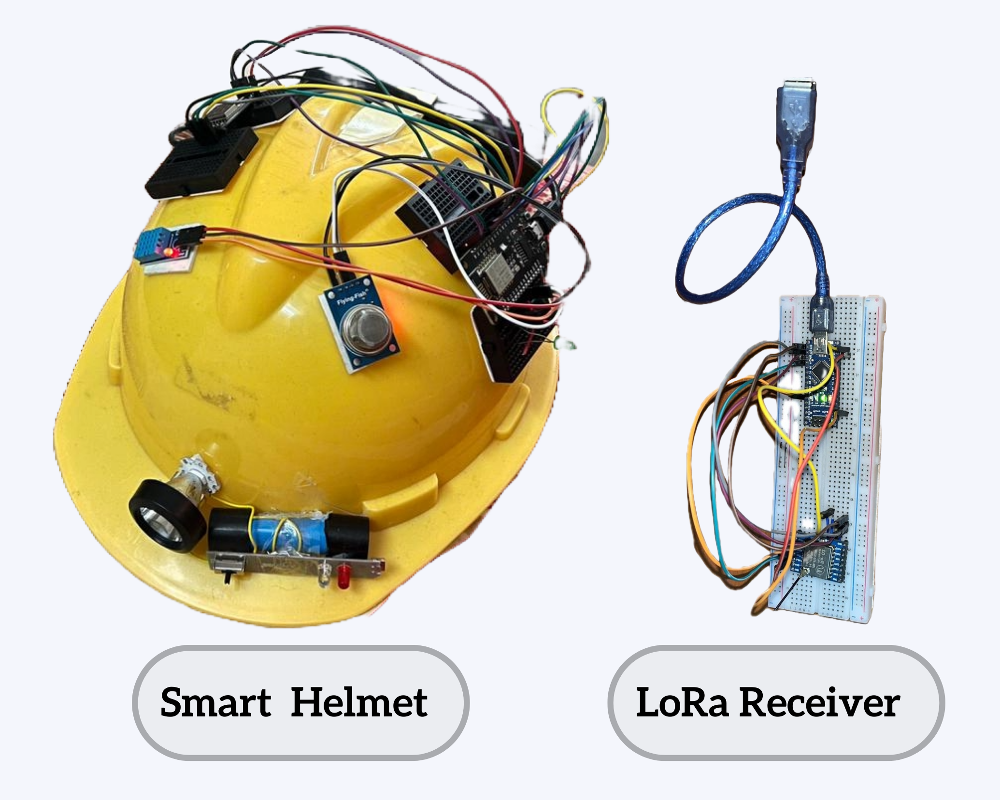
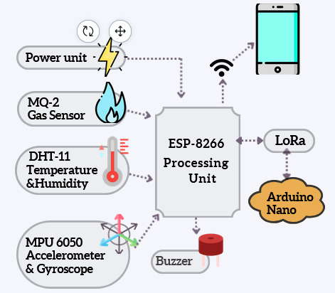
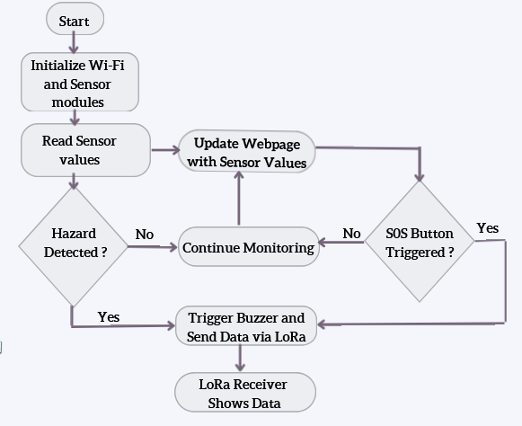
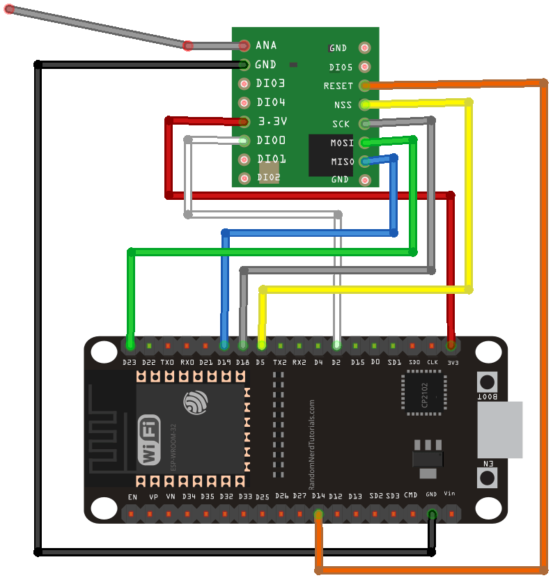
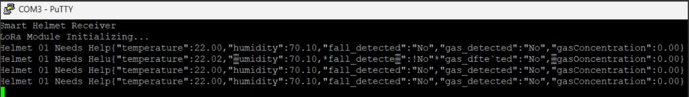

<h1 align="center">SMART HELMET FOR MINERS</h1>

  

---

## 🚀 Features

- 🔔 **Real-Time Alerts**: Triggers alerts when gas concentration, temperature, or humidity exceed predefined thresholds.
- 📡 **LoRa-Based Communication**: Transmits safety-critical data such as fall detection and gas levels over a LoRa network for long-range coverage.
- 🌐 **Wi-Fi Dashboard**: ESP8266 acts as a Wi-Fi access point, hosting an interactive web interface that displays:
  - Temperature
  - Humidity
  - Gas levels
  - Fall status
  - Emergency alerts
- 🚨 **Emergency Response**: Activates a buzzer in case of:
  - Fall detection
  - Hazardous gas concentration
  - SOS button press
- 🎨 **Color-Coded Web UI**: The web interface displays sensor data and status updates using color codes for easy interpretation by users and supervisors.

---

## ⚙️ System Implementation

  

The helmet comprises the following components:

**Module**             | **Component**        | **Function**                                                                 |
|------------------------|----------------------|------------------------------------------------------------------------------|
| **Gas Detection**      | MQ-2 / MQ-4          | Detects methane and other combustible gases; outputs analog signal.         |
| **Fall Detection**     | MPU6050              | 3-axis gyroscope and accelerometer for motion and fall detection.           |
| **Environment Sensing**| DHT11                | Measures temperature and humidity with digital output.                      |
| **Communication**      | ESP8266, LoRa        | ESP8266 enables real-time Wi-Fi data visualization; LoRa handles long-range, low-power messaging. |
| **Emergency Alerts**   | Buzzer, SOS Button   | Audible alert and manual SOS triggering in case of emergency.               |
| **Power Supply**       | Rechargeable Battery | Li-ion battery ensures portable and efficient power.                        |
---

## 🔁 System Flowchart

  

### 🧱 Flowchart Block Explanation:

1. **Start** – Begin system operation  
2. **Initialize Wi-Fi and Sensor Modules** – Setup phase for Wi-Fi & sensors  
3. **Read Sensor Values** – Collect data (temperature, humidity, gas, motion)  
4. **Update Webpage with Sensor Values** – Live environmental updates  
5. **Hazard Detected?** – Decision based on sensor thresholds  
   - ✅ Yes → Trigger buzzer and send data via LoRa  
   - ❌ No → Continue monitoring  
6. **SOS Button Pressed?** – Manual override for emergency alert  
7. **LoRa Receiver Shows Data** – Sensor data is displayed remotely  
8. **End** – The loop restarts for continuous monitoring

---

## 🔌 ESP8266 ↔ LoRa Wiring Diagram

  

---

## ✅ Results

- 🔥 Gas detection accuracy: **~90%** (post calibration)
- 🧍‍♂️ Fall detection via MPU6050: **Jerk threshold = 300,000 m/s³**
- 🌐 Real-time environment dashboard accessible via local IP
- 📡 LoRa alert transmission time: **< 1 second**
- 🎯 Lightweight, ergonomic design suitable for practical use

---

## 📊 Wi-Fi Dashboard

  

Access via: **[192.168.4.1](http://192.168.4.1)**

---

## 📡 LoRa Receiver Output

  

---

